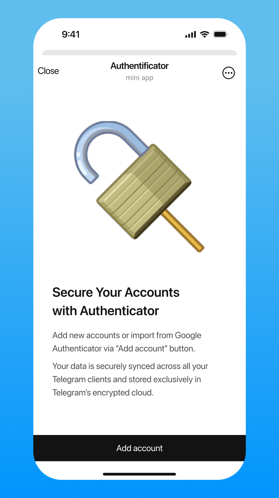

<p align="center">
  
</p>

# Authenticator for Telegram

A [Telegram Mini App](https://core.telegram.org/bots/webapps) for generating One-Time Passwords (OTP) for your 2FA-protected accounts. Like Google Authenticator, but more accessible and secure: your data is synced across all your Telegram clients and stored exclusively in Telegram's encrypted cloud. Importing from Google Authenticator is also supported.

<p align="center">
  
  &nbsp;&nbsp;&nbsp;
  
</p>

<p align="center">
  <a href="https://authenticator.tg/">Open in Telegram</a>
</p>

## Features

- Generate time-based one-time passwords (TOTP) for any service
- Import accounts by scanning QR codes
- Google Authenticator migration support (bulk import)
- Automatic light/dark theme matching with Telegram
- Cross-device sync via Telegram's built-in cloud storage
- Zero server infrastructure — fully client-side

## Development

### Prerequisites

- Node.js 18+
- Yarn

### Quick start

```bash
yarn install
yarn serve
```

Dev server starts on port 9000.

### Build

```bash
yarn build
```

Production bundle is created in `dist/`.

### Linting

```bash
yarn test:eslint     # ESLint
yarn test:tsc        # TypeScript check
yarn test:prettier   # Formatting check
```

## Tech stack

- React 18 + Redux Toolkit
- Telegram WebApp SDK (@twa-dev/sdk)
- otpauth / otplib for TOTP generation
- Webpack 5
- PostCSS + CSS Modules

## License

[MIT](LICENSE)
